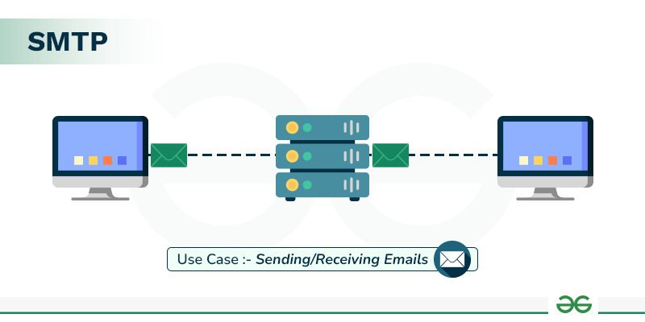

SMTP (Simple Mail Transfer Protocol) سیستمی است که برای ارسال، دریافت و انتقال ایمیل‌ها استفاده می‌شود. این سرور به عنوان یک واسطه بین فرستنده و گیرنده عمل می‌کند و ایمیل‌ها را از یک کلاینت ایمیل به مقصد منتقل می‌کند

